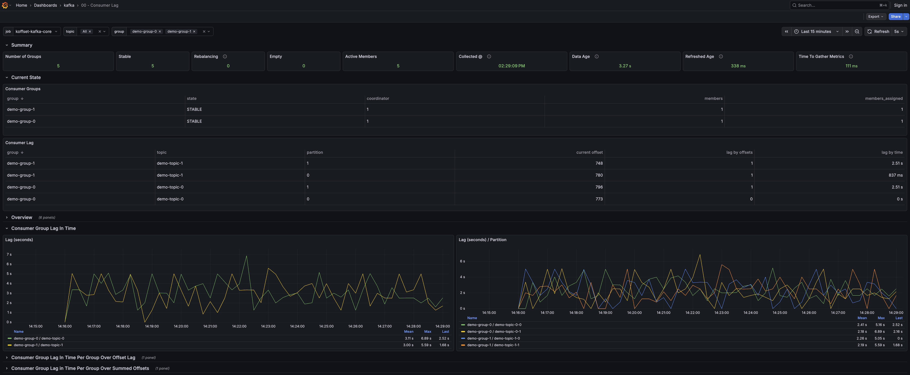

# koffset

Kafka Consumer Offset Monitoring

## 🚧Notice

The koffset project is in 0.x development. Meaning metric names and features are subject to change without
backward compatibility considerations. Once 1.x is released, the project will be considered stable and will follow
semantic versioning.

## 🔭Overview

A high-performance Kafka Consumer Offset & Lag Monitoring tool.

`koffset` provides real-time visibility into Kafka consumer group lag using only the Admin Client API, making it
lightweight, secure, and easy to deploy.



## ✨Features

* Modern Java Stack – Built on Java 25, leveraging the latest JVM performance enhancements and language features.
* Minimalist Footprint – Engineered with minimal dependencies (Kafka-clients, Netty, and SLF4J), significantly reducing
  CVE exposure and ensuring easy maintenance.
* Non-Blocking Architecture – Decouples lag collection from metric scraping. Metrics are served instantly from memory,
  ensuring high-frequency scrapes never block on Kafka API calls.
* Auto-Adjusting Collection – Features an auto-adjuster that discovers your Prometheus scrape cadence and schedules the
  background collector to finish "just before" the request arrives for maximum freshness.
* Pure Admin API – 100% Kafka AdminClient API. No Kafka Consumer APIs, seeking, or partition assignments are used,
  minimizing cluster impact.
* Optimized Memory Usage – Uses 50% less memory than other JVM-based implementations.
* Native Support - Experimental GraalVM Native Image support is provided, scaling the footprint down to ~25MB.
* Instant Intelligence – Starts in seconds. On restart, koffset pre-hydrates historical context via the Admin API to
  provide immediate, accurate timestamp lag without waiting for producer movement and without using Kafka Consumer APIs.
* Fully Configurable – Settings are configurable via environment variables for seamless container orchestration.

## 📊 Technical Comparison

The key features of koffset. You can compare these features to other Consumer Lag options and see if this
koffset is right for you.

| Feature           | koffset                                                                                     |
|-------------------|---------------------------------------------------------------------------------------------|
| Request Handling  | Decoupled. Metrics are served instantly from memory. Scrapes never wait on Kafka API calls. |
| Collection Method | Metadata Interpolation. Zero impact on partition state.                                     |
| Scalability       | O(Groups). Linear performance                                                               |
| Freshness         | Dynamic. Aligns collection to the scrape cadence.                                           |
| Operational Risk  | Only reads metadata (Kafka Admin API).                                                      |
| Resource Usage    | Low. ~150MB JVM, ~25MB Native (experimental)                                                |

## 🏗️ Architecture

'koffset` is written in Java, leveraging Java 25, Kafka Client Admin API, and Netty for asynchronous polling.
Many performance considerations are made to have accurate and up to date metrics w/out blocking API calls while scraping,
and no consumer API operations.

`koffset` maintains an internal timeline of TopicPartition "Head" offsets and timestamps. When a scrape occurs, it
calculates:

1. **Offset Lag**: `LogEndOffset - GroupOffset`
2. **Time Lag**: The difference between the current Head timestamp and the estimated time the group's committed offset
   was produced.
3. **Velocity**: Records processed per second per partition.

## 🛠Installation/Getting Start

The demo project contains a docker-compose file that can be used to quickly spin up a kafka cluster and koffset.

Run on your developer machine. A simple `./run.sh` will compile the code and then run it; it leverages the 
gradle classpath to avoid having to untar a distribution to run it.

```bash
cd koffset-exporter
export KOFFSET_KAFKA_BOOTSTRAP_SERVERS=localhost:9092
./run.sh
```

```bash
docker pull ghcr.io/kineticedge/koffset-exporter:main
```

use the `./build-docker-*` creates to create a container locally. 

Check out the demo/docker-compose.yml

## ⚙️Configuration

Configuration is handled via environment variables.

| Variable                                       | Default | Description                                                                           |
|:-----------------------------------------------|:--------|:--------------------------------------------------------------------------------------|
| `KOFFSET_KAFKA_*`                              | -       | any standard Kafka AdminClient config (e.g., `KOFFSET_KAFKA_BOOTSTRAP_SERVERS`)       |
| `KOFFSET_SERVER_PORT`                          | `8080`  | port for Prometheus style metrics                                                     |
| `KOFFSET_AUTO_ADJUST_ENABLED`                  | `true`  | enable auto-alignment with scraper                                                    |
| `KOFFSET_AUTO_ADJUST_SAMPLES`                  | `4`     | number of samples used for interval calculations (recalculates ever N)                |
| `KOFFSET_AUTO_ADJUST_TOLERANCE`                | `0.10`  | the tolerances allowed on interval calcuation to avoid too aggressrive recalculations |
| `KOFFSET_AUTO_ADJUST_SAMPLES`                  | `2000`  | minimal refresh interval to avoid the priamry scraper causing burden on kafka cluster |
| `KOFFSET_COLLECTOR_ADMIN_TIMEOUT`              | `30000` | the timout used for any Kafka Admin API call                                          |
| `KOFFSET_COLLECTOR_INITIAL_DELAY`              | `2000`  | the intial delay in starting the collector                                            |
| `KOFFSET_COLLECTOR_INITIAL_INTERVAL`           | `5000`  | the intial interval for the collector; will remain default if auto adjust is false    |
| `KOFFSET_COLLECTOR_VELOCITY_WINDOW_MULTIPLIER` | `2`     | number of intervals needed to be caculated prior to velocity metrics being emitted    |
| `KOFFSET_COLLECTOR_HISTORY_SIZE`               | -       | fallback poll interval (ms) if auto-adjust is off / not executed ...                  |
| `KOFFSET_SERVER_PORT`                          | `8080`  | the port for the HTTP server                                                          |

##  📈 Metrics

All metrics are prefixed with `koffset_` and exported in Prometheus format at the `/metrics` endpoint.

### Collection & Refresh Metrics
| Metric                               | Labels | Description                                                                     |
|:-------------------------------------|:-------|:--------------------------------------------------------------------------------|
| `koffset_refreshed_ts`               | -      | Unix timestamp (in seconds) of the last successful metadata and offset refresh. |
| `koffset_refreshed_duration_seconds` | -      | The time taken to complete the last refresh cycle from Kafka.                   |
| `koffset_refreshed_age_seconds`      | -      | Time elapsed since the last successful refresh cycle.                           |

### Summary & Group Statistics
| Metric                               | Labels                          | Description                                                                                 |
|:-------------------------------------|:--------------------------------|:--------------------------------------------------------------------------------------------|
| `koffset_number_of_groups`           |  -                              | Total number of consumer groups discovered in the cluster.                                  |
| `koffset_number_of_group_partitions` | -                               | Total number of unique topic-partitions being tracked across all groups.                    |
| `koffset_group_info`                 | `group`, `state`, `coordinator` | Value is always `1`. Provides current group state (e.g., STABLE, EMPTY) and coordinator ID. |
| `koffset_group_members`              | `group`                         | The total number of members currently in the consumer group.                                |
| `koffset_group_members_assigned`     | `group`                         | The number of group members that have at least one partition assigned to them.              |

### Topic & Partition Head Metrics
| Metric                     | Labels                 | Description                                                       |
|:---------------------------|:-----------------------|:------------------------------------------------------------------|
| `koffset_latest_offset`    | `topic`, `partition`   | The current High Watermark (HWM) or end-offset for the partition. |
| `koffset_latest_offset_ts` | `topic`, `partition`   | The timestamp associated with the latest offset in the partition. |

### Consumer Lag & Velocity Metrics
| Metric                                    | Labels                         | Description                                                                                                 |
|:------------------------------------------|:-------------------------------|:------------------------------------------------------------------------------------------------------------|
| `koffset_group_offset`                    | `group`, `topic`, `partition`  | The last committed offset for the consumer group.                                                           |
| `koffset_group_offset_interpolated_ts`    | `group`, `topic`, `partition`  | The estimated broker-time for the committed offset, calculated via linear interpolation.                    |
| `koffset_group_offset_observed_ts`        | `group`, `topic`, `partition`  | The wall-clock time when the current committed offset was first observed by the exporter.                   |
| `koffset_group_lag`                       | `group`, `topic`, `partition`  | The numeric lag (records) between the partition head and the group's committed offset.                      |
| `koffset_group_lag_seconds`               | `group`, `topic`, `partition`  | The extrapolated time-based lag (in seconds), measuring the distance between the consumer and the log head. |
| `koffset_group_offset_stale_seconds`      | `group`, `topic`, `partition`  | Measures how long the consumer has been stationary.                                                         |
| *`koffset_group_velocity_records_per_sec` | `group`, `topic`, `partition`  | The moving average processing speed of the consumer group (records/second).                                 |
| *`koffset_group_catchup_eta_seconds`      | `group`, `topic`, `partition`  | Estimated time remaining until the consumer reaches the log head based on current velocity.                 |

\* While this project is currently in alpha and any metric may change or be removed, this are highly experimental and even more likely to change or removed based on their lack of value.


## ⌨️ Usage

When configuring prometheus, it is recommended to include parameter primary=True, this identifies this as the /metric call that is happening in a consistent
scraping interval and is the one used by the auto-adjuster to have metrics refresh "right-before" the scrapes.

```
  - job_name: koffset
    scrape_interval: 5s
    metrics_path: /metrics
    params:
      primary: ["true"]
    static_configs:
      - targets:
        - koffset:8080
        labels:
          job: "koffset-kafka-core"
```

## 🖼️ Dashboards


The demo project contains a [](cluster lag) dashboard showcasing the metrics.
In additional other kafka cluster dashboards are included.  
For more ideas or dashboards to leverage, I recommend checking out [https://github.com/kineticedge/kafka-streams-dashboards](kafka-streams-dashboards).
It has dashboards well beyond kafka streams dashboards.

## 📜License

this software is under the Apache 2.0 license, for details see the project's license file
(https://github.com/kineticedge/koffset/blob/main/LICENSE)[LICENSE].

## 🤝Contributing

**TBD**